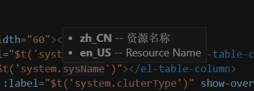
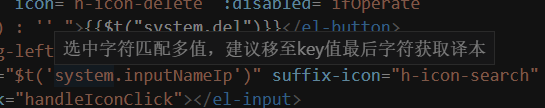

# 解决问题

当鼠标悬浮目标多语言key时，显示当前多语言对应所有语种信息。





## 使用方法

下载工程,然后放置C:\Users\用户名\.vscode\extensions （默认地址）即可。目前暂支持手动放置，未申请应用市场账号 0.0 。

默认多语言路径为vue脚手架搭建的多语言文件路径：["public/static/i18n/zh_CN/index.json", "public/static/i18n/en_US/index.json"]
也可自己设置项目多语言路径。在vscode中用户设置如下

```js
  "vscode.i18nPath": ["public/static/i18n/zh_CN/index.json", "public/static/i18n/en_US/index.json"]
```


## 注意事项

- 目前插件支持文件语言默认是后缀是.html,如果是vue文件，则需要在vscode中用户设置
```js
"files.associations": {
        "*.vue": "html"
    },
```
- vscode版本要求 ^1.29.0

- 如果鼠标移至key的最后字符串还是提示“当前匹配到多个结果”，则当前业务代码中包含连续多个国际化字符串引用，且中间未加空格。个人建议合并字符串引用，或者多个国际化字符串之间加空格处理
